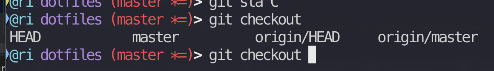

# Quick Instructions

I am assuming there is a folder called ~/dotfiles in your home folder. 

Obviously feel free to not use this if you'd prefer.

1) Delete old and get newest versions of git files.

```bash
# delete old versions of files
rm -rf ~/dotfiles/git-{completion,prompt}.{sh,bash}

# run script that re-downloads all 3. See link below if you just want to copy paste the CURL commands
./download_git_stuff.sh
```

Run the script [download_git_stuff](download_git_stuff.sh) in your dotfiles folder. It's just CURL commands, so feel free to open the file and run them manually.

2) Your ~/.zshrc will have to `source` git-completions.bash and add an fpath directive, and an autoload
  - Add the following lines to your ~/.zshrc:
    ```bash
    fpath=(~/.zsh $fpath)
    zstyle ':completion:*:*:git:*' script ~/dotfiles/git-completion.bash
    autoload -Uz compinit && compinit
    ```

  
2) Set up the actual zsh link
  ```bash
  # make a folder - we told zsh to check here for autocompletions
  mkdir ~/.zsh
  
  # make a link to git-completions.zsh, but call it _git because zsh likes underscores or some shit? 
  ln -s ~/dotfiles/git-prompt.sh ~/.zsh/_git
  ```
  
  
  
### enjoy



Note the branch names auto completing. Cool shit.
